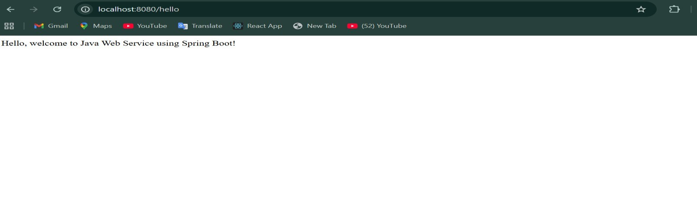
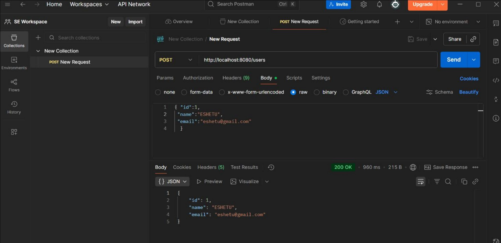
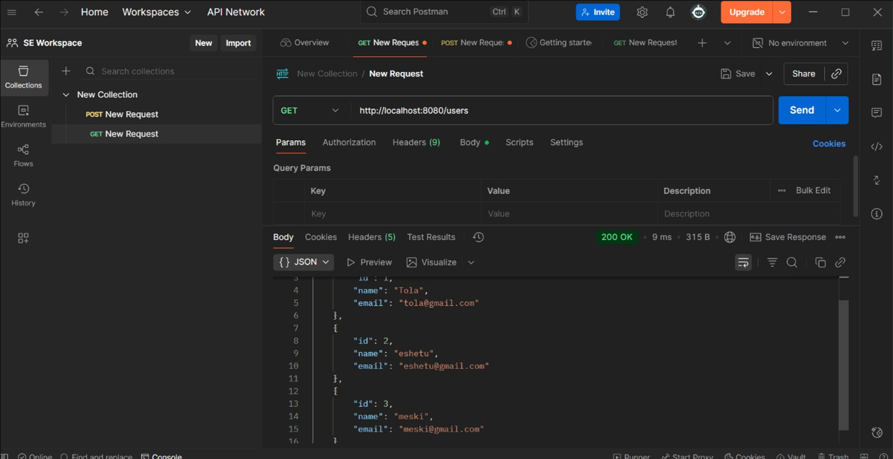
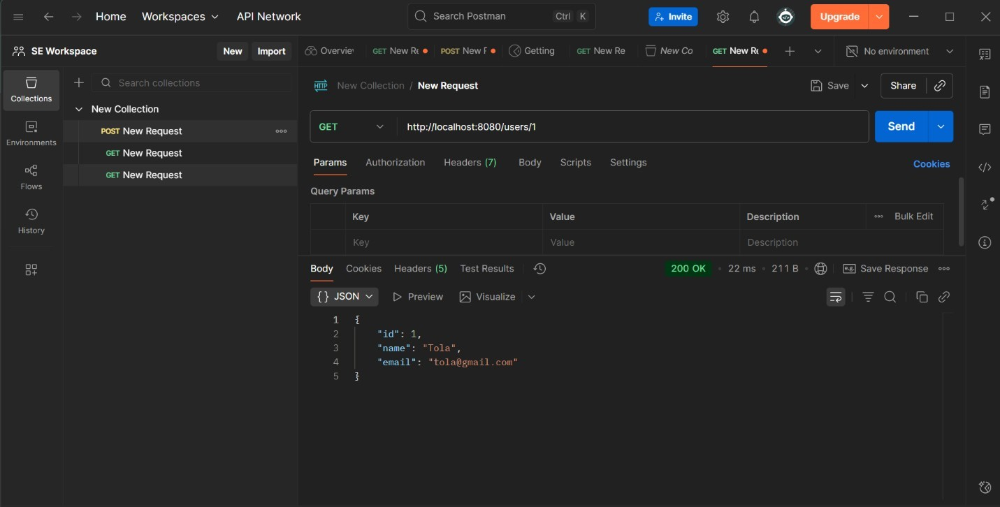
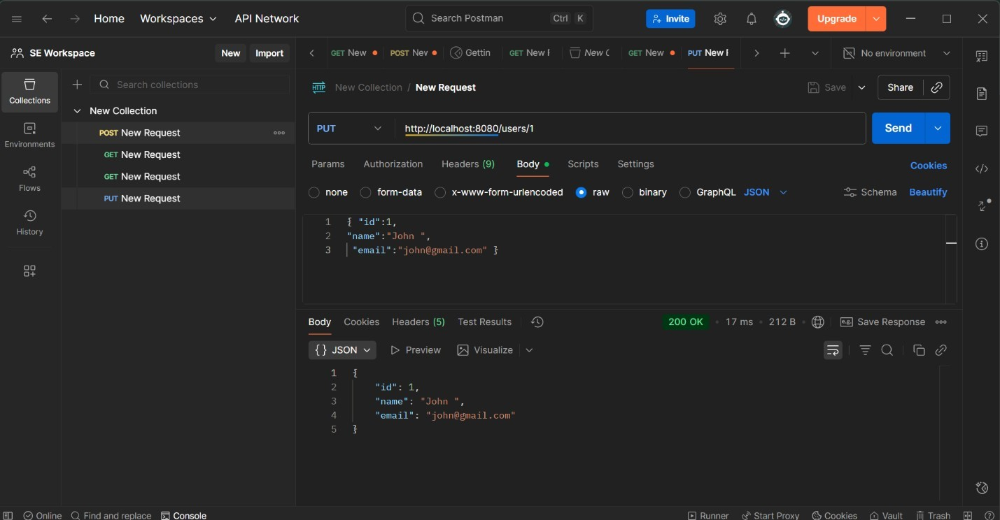
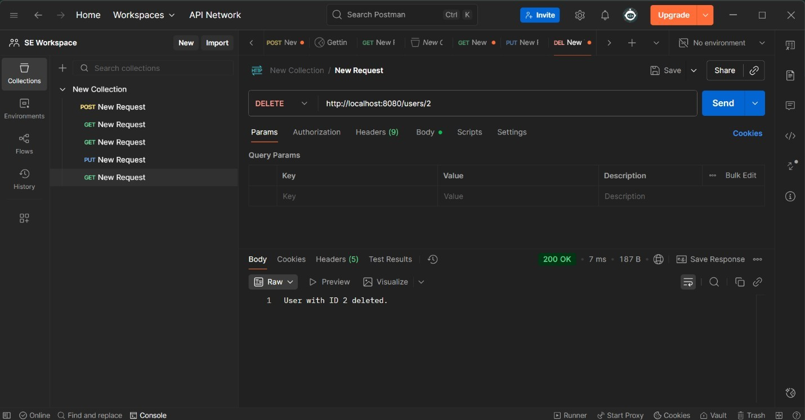
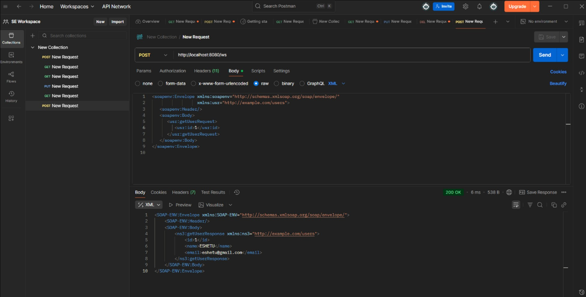

### Elective I – Web Service Report

# Java Web and SOAP Service Report

**Jimma University – Jimma Institute of Technology**  
**Faculty of Computing and Informatics**  
**Department of Software Engineering**

---


**Group Members:**
1. Adane Desta — Ru 1825/14  
2. Lemi Damena — Ru 1639/14  
3. Rushid Nura — Ru 1247/14  
4. Jamil Mohammed — Rt 10043/15  
5. Bamlak Tesfaye — Ru 0069/14  

**Submitted to:** Mr. Dessalew  

---

## 1. Java Web Service Development

### 1.1 Introduction
This exercise demonstrates creating a simple Java Web Service using **Spring Boot**.  
The service responds to HTTP requests at `/hello` with a welcome message.  
The objective is to understand how web services work and how REST endpoints handle requests.

### 1.2 Tools and Technologies
| Tool | Purpose |
|------|----------|
| JDK 25 (Temurin) | Java compiler and runtime |
| Spring Boot 3.3.2 | Framework for web services |
| Maven 3.9.11 | Build and run projects |
| VS Code | IDE for coding |
| Postman / Browser | Testing the web service |

### 1.3 Implementation Steps
1. **Verify Java Installation**
   ```bash
   java -version
   ```
   Ensure it shows openjdk version "25".

2. **Install and Configure Maven**
   ```makefile
   MAVEN_HOME = C:\Program Files\Apache\maven\apache-maven-3.9.11
   PATH += %MAVEN_HOME%\bin
   ```
   Verify installation:
   ```bash
   mvn -version
   ```

3. **Create Spring Boot Project**
   - Use **Spring Initializr**
   - Type: Maven Project, Language: Java, Spring Boot 3.3.2  
   - Dependency: `Spring Web`  
   - Project Name: `helloapi`

4. **Add REST Controller**
   ```java
   package com.example.helloapi;

   import org.springframework.web.bind.annotation.GetMapping;
   import org.springframework.web.bind.annotation.RestController;

   @RestController
   public class HelloController {
       @GetMapping("/hello")
       public String sayHello() {
           return "Hello, welcome to Java Web Service using Spring Boot!";
       }
   }
   ```

5. **Run Project**
   ```bash
   mvn spring-boot:run
   ```

6. **Test Endpoint**
   ```bash
   URL: http://localhost:8080/hello
   Response: "Hello, welcome to Java Web Service using Spring Boot!"
   ```

### 1.4 Results
- Service successfully started on port 8080.  
- `/hello` endpoint returned the expected message.


---

## 2. Web API Design and Testing (Postman)

### 2.1 Introduction
Designed and tested a RESTful Web API using Spring Boot for performing CRUD operations on user data.

### 2.2 Tools and Technologies
| Tool | Purpose |
|------|----------|
| JDK 25 | Java runtime and compiler |
| Spring Boot 3.3.x | Framework for REST API |
| Maven 3.9.x | Project build tool |
| VS Code | IDE |
| Postman | API testing tool |
| JSON | Data format for request/response |

### 2.3 Implementation Steps
1. **User Model – User.java**
   - Fields: `id`, `name`, `email`
   - Includes constructor, getters, and setters.

2. **Controller – UserController.java**
   - Handles endpoints:
     - `POST /users` – Create user  
     - `GET /users` – Get all users  
     - `GET /users/{id}` – Get single user  
     - `PUT /users/{id}` – Update user  
     - `DELETE /users/{id}` – Delete user  

3. **Run API**
   ```bash
   mvn spring-boot:run
   ```
   Base URL: `http://localhost:8080/users`

4. **Test in Postman**
   | Operation | Method | URL | Expected Response |
   |------------|---------|-----|-------------------|
   | Create | POST | /users | JSON of created user |
   | Read All | GET | /users | List of users |
   | Read One | GET | /users/1 | Single user |
   | Update | PUT | /users/1 | Updated user |
   | Delete | DELETE | /users/1 | “User with ID 1 deleted.” |

###Results
- CRUD operations tested successfully.  
- JSON responses returned as expected.  
- Verified user creation, retrieval, update, and deletion.\
- Screenshot 1: POST /users response
     
- Screenshot 2: GET /users response
     
- Screenshot 3: GET /users/1 response
     
- Screenshot 4: PUT /users/1 response
     
- Screenshot 5: DELETE /users/1 response
      
      
---

## 3. SOAP-Based Web Service

### 3.1 Introduction
Developed and tested a SOAP-based Web Service using Spring Boot and Spring Web Services (Spring-WS).  
Demonstrates how to create, configure, deploy, and consume SOAP services using XML-based communication.

### 3.2 Implementation Steps

**Step 1 – Project Setup**  
Created new Spring Boot project with dependencies:  
- `spring-boot-starter-web-services`  
- `jakarta.xml.bind-api`  
- `org.glassfish.jaxb:jaxb-runtime`  
- `spring-boot-starter-test`  

**Step 2 – Define XML Schema (`users.xsd`)**
```xml
<xs:schema xmlns:xs="http://www.w3.org/2001/XMLSchema"
           targetNamespace="http://example.com/users"
           xmlns:tns="http://example.com/users"
           elementFormDefault="qualified">

    <xs:element name="getUserRequest">
        <xs:complexType>
            <xs:sequence>
                <xs:element name="id" type="xs:long"/>
            </xs:sequence>
        </xs:complexType>
    </xs:element>

    <xs:element name="getUserResponse">
        <xs:complexType>
            <xs:sequence>
                <xs:element name="id" type="xs:long"/>
                <xs:element name="name" type="xs:string"/>
                <xs:element name="email" type="xs:string"/>
            </xs:sequence>
        </xs:complexType>
    </xs:element>

</xs:schema>
```

**Step 3 – Web Service Configuration (`WebServiceConfig.java`)**
```java
@EnableWs
@Configuration
public class WebServiceConfig {
    @Bean
    public ServletRegistrationBean<MessageDispatcherServlet> messageDispatcherServlet(ApplicationContext context) {
        MessageDispatcherServlet servlet = new MessageDispatcherServlet();
        servlet.setApplicationContext(context);
        servlet.setTransformWsdlLocations(true);
        return new ServletRegistrationBean<>(servlet, "/ws/*");
    }

    @Bean(name = "users")
    public DefaultWsdl11Definition defaultWsdl11Definition(XsdSchema usersSchema) {
        DefaultWsdl11Definition wsdl = new DefaultWsdl11Definition();
        wsdl.setPortTypeName("UserPort");
        wsdl.setLocationUri("/ws");
        wsdl.setTargetNamespace("http://example.com/users");
        wsdl.setSchema(usersSchema);
        return wsdl;
    }

    @Bean
    public XsdSchema usersSchema() {
        return new SimpleXsdSchema(new ClassPathResource("users.xsd"));
    }
}
```

**Step 4 – Request Class (`GetUserRequest.java`)**
```java
@XmlRootElement(name = "getUserRequest", namespace = "http://example.com/users")
public class GetUserRequest {
    private Long id;

    @XmlElement(namespace = "http://example.com/users")
    public Long getId() { return id; }

    public void setId(Long id) { this.id = id; }
}
```

**Step 5 – SOAP Endpoint (`UserEndpoint.java`)**
```java
@Endpoint
public class UserEndpoint {
    private static final String NAMESPACE_URI = "http://example.com/users";

    @PayloadRoot(namespace = NAMESPACE_URI, localPart = "getUserRequest")
    @ResponsePayload
    public GetUserResponse getUser(@RequestPayload GetUserRequest request) {
        GetUserResponse response = new GetUserResponse();

        if (request.getId() == 1) {
            response.setName("ESHETU");
            response.setEmail("eshetu@gmail.com");
        } else if (request.getId() == 2) {
            response.setName("JEREMY");
            response.setEmail("jeremy@gmail.com");
        } else {
            response.setName("UNKNOWN");
            response.setEmail("unknown@gmail.com");
        }

        response.setId(request.getId());
        return response;
    }
}
```

**Step 6 – Run and Access WSDL**
```bash
mvn spring-boot:run
```
WSDL URL → [http://localhost:8080/ws/users.wsdl](http://localhost:8080/ws/users.wsdl)

**Step 7 – Test with Postman**
SOAP Request:
```xml
<soapenv:Envelope xmlns:soapenv="http://schemas.xmlsoap.org/soap/envelope/"
                  xmlns:usr="http://example.com/users">
   <soapenv:Header/>
   <soapenv:Body>
      <usr:getUserRequest>
         <usr:id>1</usr:id>
      </usr:getUserRequest>
   </soapenv:Body>
</soapenv:Envelope>
```

SOAP Response:
```xml
<SOAP-ENV:Envelope xmlns:SOAP-ENV="http://schemas.xmlsoap.org/soap/envelope/">
    <SOAP-ENV:Header/>
    <SOAP-ENV:Body>
        <ns3:getUserResponse xmlns:ns3="http://example.com/users">
            <id>1</id>
            <name>ESHETU</name>
            <email>eshetu@gmail.com</email>
        </ns3:getUserResponse>
    </SOAP-ENV:Body>
</SOAP-ENV:Envelope>
```

### 3.3 Tools and Technologies
| Tool | Purpose |
|------|----------|
| Spring Boot 3.3.2 | Framework for developing SOAP services |
| Spring Web Services | Handles SOAP messaging and WSDL generation |
| Jakarta XML Bind (JAXB) | Converts Java ↔ XML |
| Maven 3.9.x | Build and dependency management |
| Visual Studio Code | IDE |
| Postman | SOAP request testing |
| Tomcat (Embedded) | Application server |

### 3.4 Results and Observations
- WSDL automatically generated from XSD schema.  
- SOAP requests/responses properly structured.  
- Verified end-to-end SOAP workflow in Postman.  
- Demonstrated fully functional SOAP-based service.
- Screenshots of Postman Soap Request and Response
  
---

## Summary
This project covers:
- RESTful API creation with CRUD operations.  
- SOAP Web Service configuration, WSDL generation, and XML-based data exchange.  
- Testing and validation using Postman.  

It demonstrates a strong understanding of **Spring Boot Web Services** — both **REST** and **SOAP** — with full implementation details and working results.
